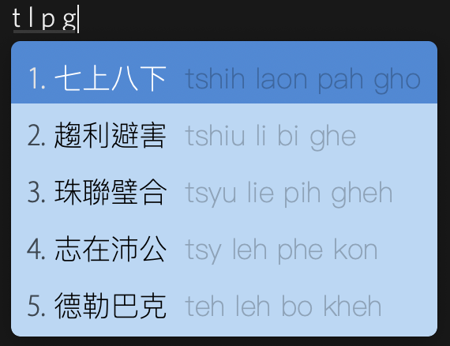
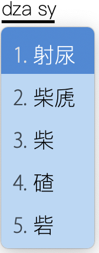
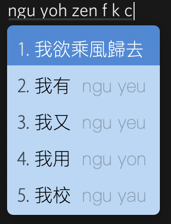

<p align="center"></p>

#  rime-yahwe_zaonhe：吳語協會式上海話輸入法

[Plum 給出的吳語拼音方案](<https://github.com/rime/rime-wugniu>)是法吳的，並不一定適合所有的用戶。這個 repo 把  Plum  方案中的 `wugniu_lopha.dict.yaml` 的拼音全部轉化爲[吳語協會式拼音](<http://wu-chinese.com/romanization/>)（稍有改動，詳見下附知乎介紹鏈接），望能方便更多用戶、使用面更廣。簡介另見知乎上的介紹文章<https://zhuanlan.zhihu.com/p/62118563> 以及 https://zhuanlan.zhihu.com/p/78791101。

| Example 1                         | Example 2                         |
| --------------------------------- | --------------------------------- |
|  |  |

## 安裝

### 準備

沒有安裝過 Rime 引擎的用戶先行安裝該輸入法引擎：<https://rime.im/download/>。

### 灋一：命令行

#### Mac，Linux

先安裝東風破：

```bash
curl -fsSL https://git.io/rime-install | bash
```

再通過東風破安裝 `rime-yahwe_zaonhe`：

```bash
cd plum
bash rime-install edward-martyr/rime-yahwe_zaonhe
```

未安裝過 rime 基本包的用戶請再輸入一行：

```bash
bash rime-install :preset 
```

#### Windows

調出`【小狼毫】方案選單設定` 的頁面，點擊「獲取更多輸入方案」，在跳出的窗口中輸入 `edward-martyr/rime-yahwe_zaonhe`。

#### 安卓

見灋二。

### 灋二：直接複製

電腦用戶將所有 `*.yaml` 文件複製到 Rime 用戶文件夾（MacOS下一般是 `~/Library/Rime/`）即可（熟悉的用戶可以忽略 `default.custom.yaml`）。

安卓 [Trime](<http://osfans.github.io/trime/>) 用戶也是將文件複製到 `sdcard/Rime` 文件夾下（每臺手機 sd 卡路徑可能不同）。

## 試用

用  `rime-yahwe_zaonhe` 也有別具一格的寫詩體驗：

```
草長鶯飛　路邊 
某種動物　塌下的五穀 
有鋤頭和花芳 
伊講 
要從布穀鳥的叫聲當中 
挑出三個 
錯別字 
因爲鋤頭講成了乳頭 
但是 
夢裏夢着的詩 
是啥言話就是啥 
翻譯不出 
不是訛轉了　燕子的詩 

—— だせい
```

自然就具備了一種 pastoralism。

## 文件說明

- `*.dict.yaml` 皆爲字典文件，若不需要則可以在 `yahwe_zaonhe.dict.yaml` 中註釋掉。
- `yahwe.schema.yaml`：輸入方案設定，包括模糊音、簡寫等設置。


## 輸入習慣

在 `yahwe.schema.yaml` 中默認是不區分尖團的，也有 `q=ch`、 `x=sh` 等方便部分用戶習慣的設置。另外設置了一些簡寫，如 `ss=sy`、`tsh=tt`、`-VV=-Vh (V is any vowel, eg. nyoo=nyoh)`，etc，熟悉的用戶都可以自定義。

可以結合Emoji一起使用，參見<https://github.com/rime/rime-emoji>，將 `schema=xxx` 改爲 `yahwe` 即可。


支持四字成語：



支持俗語（注意「射」的寫法，可爲 `dza`，蘇滬嘉小片以外口音，區分度高，也可爲 `za`，符合上海話習慣）：



可通過 `luna_pinyin.poetry.dict.yaml` 支持詩句：

